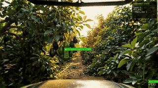

# Avocadet

A real-time computer vision system for avocado detection, counting, and ripeness classification from video streams.


## Overview

Avocadet provides an end-to-end pipeline for automated avocado analysis in agricultural settings. The system combines deep learning-based object detection (YOLOv8) with classical computer vision techniques for robust fruit identification, ripeness assessment, and size estimation.



### Key Capabilities

- **Multi-modal Detection**: Hybrid approach combining YOLOv8 object detection with HSV-based color segmentation
- **Ripeness Classification**: Automated assessment based on color analysis (unripe, nearly ripe, ripe, overripe)
- **Size Estimation**: Relative size categorization using bounding box area ratios
- **Real-time Processing**: Optimized for live video streams with interactive parameter tuning
- **Custom Training**: Built-in annotation and training tools for domain-specific model fine-tuning

## Installation

### Requirements

- Python 3.9+
- CUDA-compatible GPU (optional, for accelerated inference)

### Setup

```bash
git clone https://github.com/aaronjs99/avocadet.git
cd avocadet
pip install -e .
```

## Usage

### Command Line Interface

```bash
# Process webcam feed
python run.py --source 0

# Process video file
python run.py --source path/to/video.mp4

# Process RTSP stream
python run.py --source rtsp://camera-ip:554/stream

# Use custom-trained model
python run.py --model path/to/model.pt --mode yolo
```

### Detection Modes

| Mode | Description | Use Case |
|------|-------------|----------|
| `hybrid` | Combines segmentation and YOLO detection | Default; best overall coverage |
| `yolo` | YOLOv8 detection only | Custom-trained models |
| `segment` | Color-based segmentation only | Fast inference without GPU |

### Python API

```python
from avocadet import LivestreamProcessor

processor = LivestreamProcessor(
    source="video.mp4",
    model_path="path/to/model.pt",
    confidence_threshold=0.5,
    mode="hybrid"
)
processor.run()
```

## Custom Model Training

The package includes tools for creating custom training datasets and fine-tuning YOLOv8 models.

### 1. Annotation

Extract and annotate frames from video:

```bash
python tools/annotate.py --video input.mp4 --every 20
```

### 2. Training

Fine-tune YOLOv8 on annotated data:

```bash
python tools/train.py --dataset datasets/avocado_custom --epochs 50
```

### 3. Inference

Deploy the trained model:

```bash
python run.py --model path/to/trained_model.pt --mode yolo
```

## Architecture

The system architecture consists of four main components:

```
┌─────────────┐     ┌─────────────┐     ┌─────────────┐     ┌─────────────┐
│  Detector   │────▶│  Analyzer   │────▶│ Visualizer  │────▶│   Output    │
│  (YOLO +    │     │  (Color +   │     │  (Overlay   │     │  (Display/  │
│  Segment)   │     │   Size)     │     │   Render)   │     │   Export)   │
└─────────────┘     └─────────────┘     └─────────────┘     └─────────────┘
```

For detailed architecture documentation, see [docs/architecture.md](docs/architecture.md).

## Project Structure

```
avocadet/
├── run.py                  # CLI entry point
├── src/avocadet/
│   ├── detector.py         # Object detection (YOLO + segmentation)
│   ├── segmenter.py        # Color-based segmentation
│   ├── analyzer.py         # Ripeness and size analysis
│   ├── stream.py           # Video stream processing
│   └── visualizer.py       # Result visualization
├── tools/
│   ├── annotate.py         # Dataset annotation tool
│   └── train.py            # Model training script
├── docs/
│   ├── architecture.md     # System architecture
│   └── api.md              # API reference
└── tests/                  # Unit tests
```

## Documentation

- [Architecture Overview](docs/architecture.md) - Detailed system design and component descriptions
- [API Reference](docs/api.md) - Complete API documentation

## Citation

If you use this software in your research, please cite:

```bibtex
@software{avocadet2024,
  author = {Aaron JS},
  title = {Avocadet: Real-time Avocado Detection and Analysis},
  year = {2024},
  url = {https://github.com/aaronjs99/avocadet}
}
```

## License

This project is licensed under the MIT License. See [LICENSE](LICENSE) for details.

## Acknowledgments

- [Ultralytics YOLOv8](https://github.com/ultralytics/ultralytics) for object detection
- [OpenCV](https://opencv.org/) for image processing
