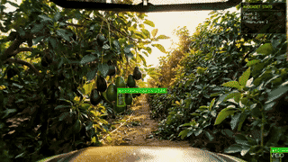

# Avocadet - ROS2 Package

Real-time avocado detection, counting, and ripeness analysis for ROS2.


> **Note**: This is the ROS2 branch. For ROS1 (Noetic), see the [master branch](https://github.com/aaronjs99/avocadet/tree/master).

<p align="center">
  
</p>


## Overview

Avocadet is a ROS2 package for automated avocado detection in agricultural robotics applications. The system combines deep learning-based object detection (YOLOv8) with classical computer vision techniques for:

- Real-time fruit detection and localization
- Ripeness classification (unripe, nearly ripe, ripe, overripe)
- Relative size estimation
- Multi-modal detection (YOLO, color segmentation, or hybrid)

## Installation

### Prerequisites

- ROS2 Humble / Iron / Jazzy
- Python 3.8+
- OpenCV 4.x
- CUDA (optional, for GPU acceleration)

### Build from Source

```bash
# Create workspace
mkdir -p ~/catkin_ws/src
cd ~/catkin_ws/src

# Clone the package
git clone -b ros2 https://github.com/aaronjs99/avocadet.git

# Install Python dependencies
cd avocadet
pip3 install ultralytics opencv-python numpy

# Build the workspace
cd ~/catkin_ws
colcon build --packages-select avocadet --symlink-install
source install/setup.bash
```

## Usage

### Basic Launch

```bash
# Launch detector (subscribes to /camera/image_raw)
ros2 launch avocadet detector.launch.py

# With custom camera topic
ros2 launch avocadet detector.launch.py image_topic:=/camera/color/image_raw

# With custom model and confidence
ros2 launch avocadet detector.launch.py \
    model_path:=/path/to/model.pt \
    confidence_threshold:=0.6
```

### Gazebo Integration

```bash
# Terminal 1: Launch Gazebo simulation
ros2 launch your_robot_package gazebo.launch.py

# Terminal 2: Launch avocadet with sim time
ros2 launch avocadet detector.launch.py \
    image_topic:=/robot/camera/image_raw \
    use_sim_time:=true
```

## Configuration

Avocadet uses a modular configuration system located in the `config/` directory.

- `detector.yaml`: Model and backend settings
- `geometry.yaml`: Lens model (pinhole/fisheye) and calibration
- `runtime.yaml`: Latency constraints and frame measurement
- `ros_topics.yaml`: ROS topic remapping
- `tiling.yaml`: Tiling strategy for high-res images

See [docs/config.md](docs/config.md) for details.

## Usage

### Basic Launch

```bash
# Launch with default configuration (loads from package config/ directory)
ros2 launch avocadet detector.launch.py

# Launch with custom configuration directory
ros2 launch avocadet detector.launch.py config_dir:=/path/to/my/config
```

### Overriding Configuration

Key parameters can be overridden directly via launch arguments:

```bash
# Override model and backend
ros2 launch avocadet detector.launch.py \
    model_path:=models/custom.engine \
    backend:=tensorrt

    lens_model:=fisheye \
    rectify_enabled:=true
```

## Standalone Usage (Non-ROS)

You can run the detector without ROS using the standalone script. This is useful for testing on videos or webcams directly.

```bash
# Run on default webcam (0)
python3 run.py

# Run on a video file
python3 run.py --source video.mp4

# Run with custom model
python3 run.py --model models/best.pt --confidence 0.5
```

## ROS2 Interface

### Subscribed Topics (Configurable in ros_topics.yaml)

- `/camera/image_raw` (sensor_msgs/Image)
- `/camera/camera_info` (sensor_msgs/CameraInfo)

### Published Topics

- `/flower/detections` (FlowerDetectionArray)
- `/fruit/detections` (FruitDetectionArray)
- `/avocadet/annotated_image` (sensor_msgs/Image)

## Message Format

Detection results are published as ROS messages:

- `avocadet/FlowerDetectionArray`: Array of `FlowerDetection` messages
- `avocadet/FruitDetectionArray`: Array of `FruitDetection` messages

Example `FruitDetection` fields:
- `bbox`: Bounding box (x, y, w, h)
- `confidence`: Detection confidence (0-1)
- `ripeness`: "unripe", "ripe", etc.
- `size_category`: "small", "medium", "large"
- `relative_size`: Ratio of fruit area to frame area
- `dominant_color`: Average RGB color


## Package Structure

avocadet/
├── package.xml             # ROS2 package manifest
├── CMakeLists.txt          # Build configuration
├── msg/                    # Custom message definitions
│   ├── BoundingBox.msg
│   ├── Color.msg
│   ├── FlowerDetection.msg
│   ├── FlowerDetectionArray.msg
│   ├── FruitDetection.msg
│   └── FruitDetectionArray.msg
├── launch/
│   └── detector.launch.py  # Launch configuration
├── config/                 # Parameter files
├── avocadet_ros/           # ROS2 nodes
│   ├── __init__.py
│   └── detector_node.py    # Main detector node
├── avocadet_lib/           # Core detection library
│   ├── detector.py         # Unified Detector
│   ├── geometry.py         # Lens geometry & tiling
│   ├── analyzer.py         # Ripeness & size analysis
│   ├── stream.py           # Video stream processing
│   └── visualizer.py       # Visualization utilities
├── tools/                  # Training utilities
│   ├── annotate.py         # Dataset annotation
│   └── train.py            # Model training
└── tests/                  # Unit tests
```

## Custom Model Training

Train a custom detection model for your specific avocado varieties:

```bash
# 1. Annotate frames from your video
python3 tools/annotate.py --video demo.mp4 --every 20

# 2. Train YOLOv8
python3 tools/train.py --dataset datasets/custom --epochs 50

# 3. Use trained model
ros2 launch avocadet detector.launch.py model_path:=/path/to/best.pt
```

## Authors

- Aaron John Sabu
- Sunwoong Choi
- Sriram Narasimhan

## License

This project is licensed under the MIT License. See [LICENSE](LICENSE) for details.

## See Also

- [ROS1 Version (master branch)](https://github.com/aaronjs99/avocadet/tree/master)
- [Ultralytics YOLOv8](https://github.com/ultralytics/ultralytics)
