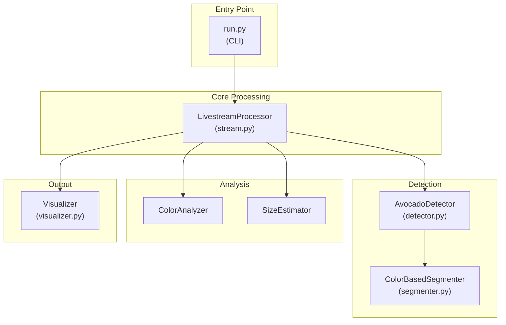
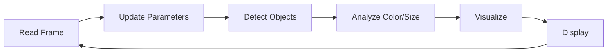
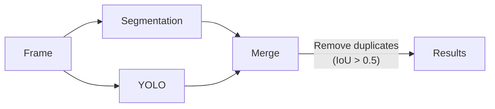
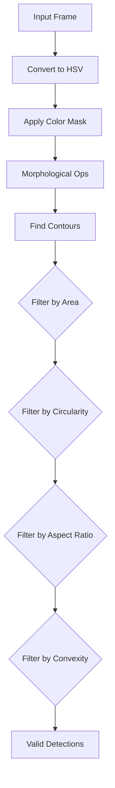
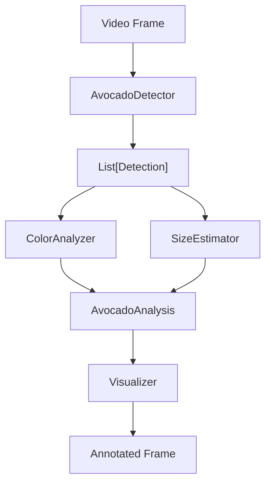

# Architecture Overview

This document provides a detailed explanation of the Avocadet codebase architecture and how each component works together.

## System Architecture



## Component Details

### 1. Entry Point (`run.py`)

The main entry point that provides CLI argument parsing and initializes the processing pipeline.

**Key Arguments:**
- `--source`: Video source (webcam ID, file path, or stream URL)
- `--model`: Path to custom YOLO model weights
- `--mode`: Detection mode (`yolo`, `segment`, or `hybrid`)
- `--confidence`: Minimum detection confidence threshold

**Flow:**
1. Parse command-line arguments
2. Create `LivestreamProcessor` with specified configuration
3. Start the processing loop
4. Handle keyboard interrupts gracefully

---

### 2. Livestream Processor (`stream.py`)

The central orchestrator that manages the video processing pipeline.

**Class: `LivestreamProcessor`**

```python
def __init__(
    source: Union[int, str],      # Video source
    model_path: Optional[str],     # YOLO model path
    confidence_threshold: float,   # Detection threshold
    process_every_n_frames: int,   # Frame skip for performance
    mode: str                      # Detection mode
)
```

**Responsibilities:**
- Opens and manages video capture from multiple source types
- Creates trackbar controls for real-time parameter adjustment
- Coordinates detection, analysis, and visualization
- Handles keyboard input (quit, pause, screenshot, fullscreen)

**Processing Loop:**



---

### 3. Avocado Detector (`detector.py`)

Handles object detection using multiple strategies.

**Detection Modes:**

| Mode | Description | Use Case |
|------|-------------|----------|
| `yolo` | Uses YOLOv8 only | Best with custom-trained model |
| `segment` | Color-based segmentation only | Fast, no model needed |
| `hybrid` | Combines both methods | Default, best coverage |

**Hybrid Mode Flow:**



**Data Class: `Detection`**
```python
@dataclass
class Detection:
    bbox: Tuple[int, int, int, int]  # (x1, y1, x2, y2)
    confidence: float                 # 0.0 - 1.0
    class_name: str                   # "avocado"
```

---

### 4. Color-Based Segmenter (`segmenter.py`)

Detects avocados based on color and shape characteristics.

**HSV Color Range:**
```python
HSV_LOWER = [25, 40, 40]   # Dark yellow-green
HSV_UPPER = [85, 200, 180] # Darker greens (excludes bright leaves)
```

**Detection Pipeline:**



**Why These Filters?**
- **Area**: Filters out small noise and large background regions
- **Circularity**: Avocados are rounder than leaves (which are elongated)
- **Aspect Ratio**: Avocados are oval, not thin like leaves
- **Convexity**: Avocados are smooth, jagged leaves have low convexity

---

### 5. Color Analyzer (`analyzer.py`)

Analyzes detected regions to determine ripeness and dominant color.

**Ripeness Classification:**

| Ripeness | Hue Range | Description |
|----------|-----------|-------------|
| `unripe` | 35-85 | Bright green |
| `nearly_ripe` | 25-35 | Yellow-green |
| `ripe` | 15-25 | Brown-green |
| `overripe` | 0-15, 160+ | Dark brown/black |

**Algorithm:**
1. Extract ROI (region of interest) from bounding box
2. Convert to HSV color space
3. Apply K-means clustering (k=3) to find dominant colors
4. Select the largest cluster as dominant color
5. Map hue value to ripeness category

**Size Categories:**
```python
SMALL_THRESHOLD = 0.02   # < 2% of frame area
LARGE_THRESHOLD = 0.08   # > 8% of frame area
```

---

### 6. Visualizer (`visualizer.py`)

Renders detection results and statistics overlay.

**Visual Elements:**
1. **Bounding Boxes**: Color-coded by ripeness
2. **Labels**: Detection ID, ripeness, size, confidence
3. **Color Swatches**: Shows dominant color of each detection
4. **Stats Panel**: Semi-transparent overlay with count, FPS, breakdown

**Color Scheme:**
```python
RIPENESS_COLORS = {
    'unripe':      (0, 255, 0),    # Green
    'nearly_ripe': (0, 255, 255),  # Yellow
    'ripe':        (0, 165, 255),  # Orange
    'overripe':    (0, 0, 255)     # Red
}
```

---

## Training Pipeline

### Annotation Tool (`tools/annotate.py`)

Interactive tool for creating training data from video frames.

**Workflow:**
1. Extract frames at specified interval
2. For each frame, user draws bounding boxes
3. Save images to `datasets/avocado_custom/images/train/`
4. Save YOLO-format labels to `datasets/avocado_custom/labels/train/`
5. Generate `data.yaml` configuration file

### Training Script (`tools/train.py`)

Fine-tunes YOLOv8 on custom dataset.

**Key Parameters:**
- `--epochs`: Training iterations (default: 50)
- `--batch`: Batch size (reduce if OOM)
- `--imgsz`: Image size (default: 640)
- `--device`: GPU ID or "cpu"

---

## Data Flow Summary



---

## Performance Considerations

1. **Frame Skipping**: Use `--skip-frames N` to process every Nth frame
2. **Model Size**: Smaller models (yolov8n) are faster but less accurate
3. **Segmentation Mode**: Faster than YOLO, good for real-time on CPU
4. **Resolution**: Lower resolution = faster processing

## Extending the System

### Adding New Detection Classes

1. Modify `ColorBasedSegmenter` HSV ranges
2. Train custom YOLO model with new classes
3. Update `AvocadoDetector.FRUIT_CLASSES`

### Custom Ripeness Logic

Modify `ColorAnalyzer.RIPENESS_RANGES` to adjust hue thresholds.

### Adding New Video Sources

`LivestreamProcessor` accepts any OpenCV-compatible source string.
